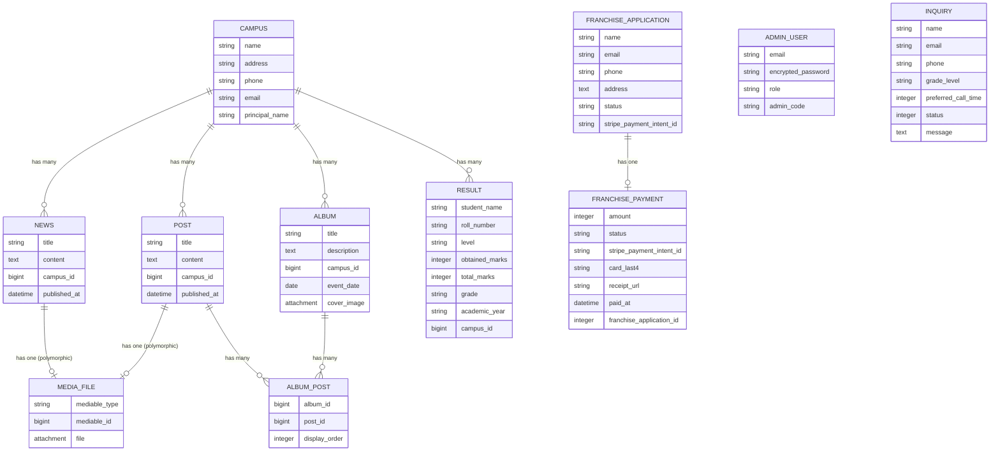

<p align="center">
  
  
  
  
  
  
  
</p>

# 🏫 Britain International School — Public Website & Admin Panel

A full-featured, public-facing website for **Britain International School & Colleges Network (BICN)** — a multi-campus school franchise based in Pakistan. The application includes a polished marketing website for parents and students, alongside a secure admin panel for staff to manage campuses, content, media, inquiries, and franchise applications with integrated Stripe payments.

---

## 📑 Table of Contents

- [Features](#-features)
- [Tech Stack](#-tech-stack)
- [Architecture Overview](#-architecture-overview)
- [Database Schema](#-database-schema)
- [Authorization & Roles](#-authorization--roles)
- [Third-Party Integrations](#-third-party-integrations)
- [Stimulus Controllers](#-stimulus-controllers)
- [Project Structure](#-project-structure)
- [Getting Started](#-getting-started)
- [Seeding the Database](#-seeding-the-database)
- [Environment Variables & Credentials](#-environment-variables--credentials)
- [Running Tests](#-running-tests)
- [Deployment](#-deployment)
- [Contributing](#-contributing)
- [License](#-license)

---

## ✨ Features

### 🌐 Public Website

| Page | Description |
|------|-------------|
| **Home** | Hero carousel, animated statistics counters, latest news grid, and a contact section |
| **About** | School history, mission, vision, and scroll-reveal animated content |
| **Campuses** | All 40+ campuses organized by category (Premium, Sub-Premium, Multan, Colleges, Out-of-Station) |
| **News** | Published news articles with campus-based filtering and text search |
| **Gallery** | Photo/video albums organized by campus and event, with media modal viewer |
| **Admissions** | Inquiry form with email, phone, grade level, and preferred call time |
| **Buy a Franchise** | Franchise application form with Stripe-powered payment processing |

### 🔐 Admin Panel (`/admin`)

| Module | Capabilities |
|--------|-------------|
| **Dashboard** | At-a-glance stats — posts, campuses, pending inquiries, news count, albums, and contact trends |
| **Posts** | Full CRUD with polymorphic media (image/video) upload via Active Storage |
| **News** | Create and publish news articles with optional media attachments, scoped by campus |
| **Campuses** | Manage all campus records (name, address, phone, email, principal) |
| **Albums** | Create photo/video albums, attach posts, set cover images, organize by event date |
| **Inquiries** | View all admission inquiries with status tracking (Pending → Contacted → Closed) |
| **Franchise Apps** | Manage franchise applications, view payment details, and track status (Super Admin only) |

### 🛡️ Security & Authorization

- **Devise** authentication for admin users with role-based access
- **Pundit** policy-based authorization with granular per-action permissions
- CSRF protection, CSP headers, and parameter filtering
- Secure Stripe webhook signature verification

### 📧 Email & Background Jobs

- Automatic email notifications on new inquiries (to school staff)
- Confirmation emails sent to inquiry submitters
- **Sidekiq** background job processing for non-blocking email delivery
- HTML + plain text email templates

---

## 🛠 Tech Stack

| Layer | Technology |
|-------|-----------|
| **Framework** | Ruby on Rails 8.1.3 |
| **Language** | Ruby 3.3.5 |
| **Database** | PostgreSQL |
| **Frontend** | Hotwire (Turbo + Stimulus), Tailwind CSS 4, Import Maps |
| **Asset Pipeline** | Propshaft |
| **Authentication** | Devise |
| **Authorization** | Pundit |
| **Forms** | Simple Form |
| **File Storage** | Active Storage (local disk, S3/GCS-ready) |
| **Image Processing** | ImageProcessing (libvips) |
| **Payments** | Stripe (PaymentIntents API + Webhooks) |
| **Background Jobs** | Sidekiq (Redis-backed) |
| **Deployment** | Docker, Kamal, Thruster |
| **Web Server** | Puma |
| **Internationalization** | Rails I18n (Centralized string management) |
| **Testing** | RSpec |
| **Code Quality** | RuboCop (Rails Omakase), Brakeman, Bundler Audit |

---

## 🏗 Architecture Overview

```
┌─────────────────────────────────────────────────────────────────┐
│                        PUBLIC WEBSITE                           │
│  ┌──────────┐ ┌────────┐ ┌──────────┐ ┌─────────┐ ┌─────────┐ │
│  │   Home   │ │ About  │ │ Campuses │ │  News   │ │ Gallery │ │
│  └──────────┘ └────────┘ └──────────┘ └─────────┘ └─────────┘ │
│  ┌───────────────┐ ┌──────────────────┐                        │
│  │  Admissions   │ │ Buy a Franchise  │                        │
│  │ (Inquiry Form)│ │ (Stripe Payment) │                        │
│  └───────────────┘ └──────────────────┘                        │
└─────────────────────────┬───────────────────────────────────────┘
                          │
              ┌───────────┴───────────┐
              │    Rails Router       │
              │  (config/routes.rb)   │
              └───────────┬───────────┘
                          │
    ┌─────────────────────┼─────────────────────┐
    │                     │                     │
    ▼                     ▼                     ▼
┌────────┐        ┌──────────────┐      ┌────────────┐
│ Public │        │    Admin     │      │  Webhooks  │
│Contrlrs│        │ Controllers  │      │ Controller │
└───┬────┘        └──────┬───────┘      └──────┬─────┘
    │                    │                     │
    │             ┌──────┴───────┐             │
    │             │  Devise Auth │             │
    │             │  + Pundit    │             │
    │             └──────┬───────┘             │
    │                    │                     │
    ▼                    ▼                     ▼
┌─────────────────────────────────────────────────┐
│              Models & Business Logic            │
│  ┌───────┐ ┌──────┐ ┌──────┐ ┌───────────────┐ │
│  │Campus │ │Post  │ │News  │ │  MediaFile    │ │
│  │Album  │ │Result│ │Inquiry│ │ (polymorphic) │ │
│  │FranchiseApplication│ │FranchisePayment│    │ │
│  └───────┘ └──────┘ └──────┘ └───────────────┘ │
└───────────────────────┬─────────────────────────┘
                        │
        ┌───────────────┼───────────────┐
        ▼               ▼               ▼
  ┌──────────┐   ┌────────────┐  ┌───────────┐
  │PostgreSQL│   │Active      │  │  Sidekiq  │
  │          │   │Storage     │  │  (Redis)  │
  └──────────┘   │(File Store)│  └───────────┘
                 └────────────┘
```

The app follows the classic **MVC pattern** with clear separation:

- **Public controllers** serve the marketing site (no auth required)
- **Admin controllers** inherit from `Admin::BaseController` which enforces Devise authentication and uses a dedicated admin layout
- **Pundit policies** gate every admin action by user role
- **Polymorphic media** via `MediaFile` allows attaching images/videos to both `Post` and `News` models

---

## 🗄 Database Schema

### Entity Relationship Diagram



### Key Models

| Model | Description |
|-------|-------------|
| `Campu` | Represents a physical school campus with contact details and principal info |
| `Post` | Content post (text, image, or video) belonging to a campus, with polymorphic media |
| `News` | News articles with optional campus association and publication timestamps |
| `MediaFile` | Polymorphic file attachment (image/video, max 10 MB) linked to `Post` or `News` |
| `Album` | Event-based photo/video collection with cover image and ordered posts |
| `AlbumPost` | Join table linking albums to posts with `display_order` |
| `Result` | Student academic result with marks, grade, and academic year |
| `Inquiry` | Admission inquiry with status tracking (`pending` → `contacted` → `closed`) |
| `FranchiseApplication` | Franchise application with Stripe payment workflow |
| `FranchisePayment` | Payment record linked to a franchise application |
| `AdminUser` | Devise-authenticated admin with role (`super_admin` / `campus_manager`) |

---

## 🔒 Authorization & Roles

The application uses **Pundit** for policy-based authorization with two admin roles:

### Role Permissions Matrix

| Resource | Action | `super_admin` | `campus_manager` |
|----------|--------|:---:|:---:|
| **Posts** | View | ✅ | ✅ |
| **Posts** | Create / Edit | ✅ | ✅ |
| **Posts** | Delete | ✅ | ❌ |
| **Posts** | Remove Media | ✅ | ✅ |
| **News** | View | ✅ | ✅ |
| **News** | Create / Edit / Delete | ✅ | ❌ |
| **News** | Remove Media | ✅ | ❌ |
| **Campuses** | View | ✅ | ✅ |
| **Campuses** | Create / Edit / Delete | ✅ | ❌ |
| **Albums** | View | ✅ | ✅ |
| **Albums** | Create / Edit | ✅ | ✅ |
| **Albums** | Delete | ✅ | ❌ |
| **Inquiries** | View / Mark Contacted | ✅ | ✅ |
| **Franchise Apps** | View / Update Status | ✅ | ❌ |

---

## 🔗 Third-Party Integrations

### Stripe (Payment Processing)

The franchise application flow uses Stripe's **PaymentIntents API**:

```
┌──────────────┐     ┌───────────┐     ┌─────────────┐     ┌─────────────┐
│ Franchise    │────▶│ Create    │────▶│ Stripe      │────▶│ Redirect to │
│ Application  │     │ Payment   │     │ Payment     │     │ Success /   │
│ Form         │     │ Intent    │     │ Page        │     │ Cancel      │
└──────────────┘     └───────────┘     └─────────────┘     └─────────────┘
                                             │
                                             ▼
                                       ┌─────────────┐
                                       │ Webhook      │
                                       │ Verification │
                                       └─────────────┘
```

- **Franchise Fee**: $500 (50,000 cents)
- **Service Object**: `StripePaymentService` encapsulates all API interactions (PaymentIntent creation, event construction)
- **Credentials**: Stored in Rails encrypted credentials (`stripe.secret_key`, `stripe.webhook_secret`)
- **Webhook Endpoint**: `POST /stripe/webhooks` with signature verification
- **Payment Statuses**: `pending_payment` → `payment_received` → `approved` / `rejected`

### Internationalization (i18n)

The application uses Rails I18n to manage all user-facing constant strings, flash messages, and form labels. This ensures consistency and makes the app ready for future localization.

- **Storage**: `config/locales/en.yml`
- **Scopes**: Organized by controller and action (e.g., `t('flash.admin.news.created')`)
- **Usage**: Centralized success/error messages for all CRUD operations

### Sidekiq (Background Jobs)

- **Adapter**: Configured as Active Job backend
- **Queues**: `default`, `mailers`
- **Concurrency**: 5 workers
- **Requires**: Redis server running locally or via `REDIS_URL`

### Action Mailer (Email Notifications)

Two emails are triggered on each new admission inquiry via `InquiryEmailJob`:

1. **`inquiry_received`** — Notifies school staff of a new inquiry
2. **`confirmation_email`** — Sends a confirmation to the submitter

Both are available in HTML and plain text formats.

---

## ⚡ Stimulus Controllers

The frontend uses **Hotwire Stimulus** for interactive behavior without heavy JavaScript frameworks:

| Controller | Purpose |
|-----------|---------|
| `about_controller` | Scroll-triggered reveal animations on the About page |
| `campuses_controller` | Interactive campus listing with category tabs and filtering |
| `carousel_controller` | Hero image carousel with auto-advance and navigation controls |
| `counter_controller` | Animated number counters that trigger on scroll into viewport |
| `file_size_controller` | Client-side file size validation for media uploads |
| `flash_controller` | Auto-dismissing flash notification messages (7s timeout) |
| `menu_controller` | Mobile responsive navigation menu toggle |
| `news_modal_controller` | Full-screen modal viewer for news articles with media |
| `reveal_controller` | Intersection Observer-based scroll reveal animations |
| `scroll_carousal_controller` | Horizontal scroll-based carousel for content sections |

---

## 📂 Project Structure

```
school2/
├── app/
│   ├── assets/
│   │   ├── builds/              # Compiled CSS output
│   │   ├── images/              # Static image assets
│   │   ├── stylesheets/         # Custom stylesheets
│   │   └── tailwind/            # Tailwind CSS configuration
│   ├── controllers/
│   │   ├── admin/               # Admin-namespaced controllers
│   │   │   ├── base_controller.rb       # Auth + admin layout
│   │   │   ├── dashboard_controller.rb  # Admin dashboard stats
│   │   │   ├── posts_controller.rb      # CRUD for posts
│   │   │   ├── news_controller.rb       # CRUD for news
│   │   │   ├── albums_controller.rb     # CRUD for albums
│   │   │   ├── campu_controller.rb      # CRUD for campuses
│   │   │   ├── inquiries_controller.rb  # Inquiry management
│   │   │   ├── franchise_applications_controller.rb # Manage applications & payments
│   │   │   └── sessions_controller.rb   # Devise session overrides
│   │   ├── pages_controller.rb          # Home & About pages
│   │   ├── campuses_controller.rb       # Public campus listing
│   │   ├── news_controller.rb           # Public news with filtering
│   │   ├── gallery_controller.rb        # Public gallery & albums
│   │   ├── inquiries_controller.rb      # Admission inquiry form
│   │   ├── franchise_applications_controller.rb  # Franchise + Stripe
│   │   └── webhooks_controller.rb       # Stripe webhook handler
│   ├── javascript/
│   │   └── controllers/         # Stimulus controllers (11 total)
│   ├── jobs/
│   │   └── inquiry_email_job.rb # Background email delivery
│   ├── mailers/
│   │   └── inquiry_mailer.rb    # Inquiry notification emails
│   ├── models/                  # 12 Active Record models
│   ├── policies/                # 6 Pundit authorization policies
│   └── views/
│       ├── admin/               # Admin panel views
│       ├── pages/               # Home & About views
│       ├── campuses/            # Campus listing view
│       ├── news/                # News index with filters
│       ├── gallery/             # Gallery & album views
│       ├── inquiries/           # Admission form
│       ├── franchise_applications/  # Franchise flow views
│       ├── inquiry_mailer/      # Email templates (HTML + text)
│       ├── shared/              # Navbar & footer partials
│       ├── layouts/             # Application & admin layouts
│       └── devise/              # Authentication views
├── config/
│   ├── routes.rb                # All application routes
│   ├── database.yml             # PostgreSQL configuration
│   ├── importmap.rb             # ES module import mapping
│   ├── sidekiq.yml              # Sidekiq queue configuration
│   ├── storage.yml              # Active Storage backends
│   └── initializers/
│       ├── devise.rb            # Devise configuration
│       ├── simple_form.rb       # Simple Form configuration
│       └── stripe.rb            # Stripe API key setup
├── db/
│   ├── schema.rb                # Current database schema
│   ├── seeds.rb                 # Seed data (40+ campuses, sample data)
│   └── migrate/                 # 20 migration files
├── Dockerfile                   # Production Docker image
├── Procfile.dev                 # Dev process manager (web + CSS)
├── Gemfile                      # Ruby dependencies
└── .ruby-version                # Ruby 3.3.5
```

---

## 🚀 Getting Started

### Prerequisites

| Requirement | Version |
|------------|---------|
| Ruby | 3.3.5 |
| Rails | 8.1.3 |
| PostgreSQL | 14+ |
| Redis | 6+ (for Sidekiq) |
| Node.js | 18+ (for Tailwind CSS CLI) |
| libvips | Latest (for image processing) |

### 1. Clone the Repository

```bash
git clone https://github.com/haniamariya-web/School_Public_Website.git
cd School_Public_Website
```

### 2. Install Dependencies

```bash
bundle install
```

### 3. Database Setup

```bash
# Create the databases
bin/rails db:create

# Run all migrations
bin/rails db:migrate

# Seed with sample data (40+ campuses, sample posts, albums, results, admin users)
bin/rails db:seed
```

### 4. Configure Credentials

Set up your encrypted credentials for Stripe and other secrets:

```bash
bin/rails credentials:edit
```

Add the following structure:

```yaml
stripe:
  secret_key: sk_test_your_stripe_secret_key
  webhook_secret: whsec_your_webhook_signing_secret
```

### 5. Start Redis (for Sidekiq)

```bash
redis-server
```

### 6. Start Sidekiq (in a separate terminal)

```bash
bundle exec sidekiq
```

### 7. Run the Application

```bash
# Using Procfile.dev (starts Rails server + Tailwind CSS watcher)
bin/dev

# Or manually
bin/rails server
```

Visit **http://localhost:3000** for the public site and **http://localhost:3000/admin** for the admin panel.

### Default Admin Credentials (from seeds)

| Role | Email | Password |
|------|-------|----------|
| Super Admin | `superadmin@school.com` | `password123` |
| Campus Manager | `manager@school.com` | `password123` |

> ⚠️ **Important**: Change these credentials immediately in production.

---

## 🌱 Seeding the Database

The seed file (`db/seeds.rb`) creates:

- **40+ campuses** across 5 categories (Premium, Sub-Premium, Multan, Colleges, Out-of-Station)
- **3 sample posts** (text, image, and video types)
- **2 sample albums** with event dates
- **2 sample student results**
- **2 admin users** (super_admin + campus_manager)

Run seeds:

```bash
bin/rails db:seed
```

> **Note**: Seeds are idempotent for admin users but will clear and recreate Posts, Albums, Results, and Campuses on each run.

---

## 🔐 Environment Variables & Credentials

| Variable | Purpose | Location |
|----------|---------|----------|
| `SCHOOL2_DATABASE_PASSWORD` | Production database password | Environment |
| `RAILS_MASTER_KEY` | Decrypts `credentials.yml.enc` | Environment / `config/master.key` |
| `REDIS_URL` | Redis connection for Sidekiq | Environment (defaults to `localhost:6379`) |
| `stripe.secret_key` | Stripe API secret key | Rails credentials |
| `stripe.webhook_secret` | Stripe webhook signing secret | Rails credentials |

---

## 🧪 Running Tests

The project uses **RSpec** for unit, functional, and integration testing.

```bash
# Run the full test suite
bundle exec rspec

# Run specific specs
bundle exec rspec spec/models/
bundle exec rspec spec/requests/

# Security & Quality audits
bundle exec rubocop
bundle exec brakeman
bundle exec bundler-audit check
```

---

## 🚢 Deployment

### Docker

The project includes a production-ready, multi-stage `Dockerfile`:

```bash
# Build the image
docker build -t school2 .

# Run the container
docker run -d -p 80:80 \
  -e RAILS_MASTER_KEY=<your_master_key> \
  -e SCHOOL2_DATABASE_PASSWORD=<your_db_password> \
  --name school2 school2
```

The Docker image uses:
- **Ruby 3.3.5 slim** base image
- **jemalloc** for optimized memory allocation
- **Thruster** for HTTP asset caching/compression and X-Sendfile acceleration
- **Non-root user** for security
- Multi-stage build to minimize final image size

### Kamal

The project is configured for [Kamal](https://kamal-deploy.org/) deployment (see `config/deploy.yml`):

```bash
# Setup and deploy
kamal setup

# Deploy updates
kamal deploy

# Check status
kamal details
```

### Production Checklist

- [ ] Set `RAILS_MASTER_KEY` environment variable
- [ ] Set `SCHOOL2_DATABASE_PASSWORD` environment variable
- [ ] Configure Stripe live keys in Rails credentials
- [ ] Set up a Redis instance for Sidekiq
- [ ] Configure Active Storage for cloud storage (S3/GCS) in `config/storage.yml`
- [ ] Configure Action Mailer SMTP settings for production emails
- [ ] Set up Stripe webhook endpoint pointing to `https://yourdomain.com/stripe/webhooks`
- [ ] Run `bin/rails db:migrate` on the production database
- [ ] Change default admin credentials after first login
- [ ] Enable SSL/TLS termination

---

## 🤝 Contributing

1. Fork the repository
2. Create a feature branch (`git checkout -b feature/amazing-feature`)
3. Commit your changes (`git commit -m 'Add amazing feature'`)
4. Push to the branch (`git push origin feature/amazing-feature`)
5. Open a Pull Request

---

## 📄 License

This project is proprietary software. All rights reserved.

---

<p align="center">
  Built with ❤️ by <a href="https://github.com/haniamariya-web">haniamariya-web</a>
  <br/>
  <strong>Britain International School & Colleges Network</strong>
</p>